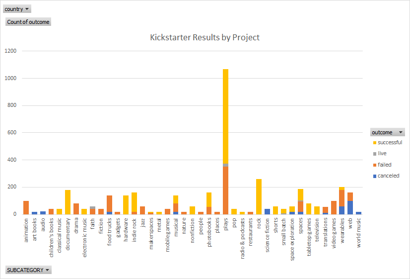

# "An Analysis of Kickstarter Campaigns by William Davis"
This is is an anlaysis that I have prepared for Louise to consider when planning her next kickstarter campaign.   
## General Remarks 
To begin the analysis of this kickstarter campaign our group started by collecting all of the sample of data caputred during previous campaigns. This analysis covers 4114 crowdfunding projects to uncover any hidden trends. The data was sorted and filtered in various categories including  goal and pledged amounts, percentgage funded , average donation, outcome, country, currency, deadline, dates, staff pick, category etc. This enabled us to ease to make quick observaitions regarding the collected data and identifiy apparent trends at a glance. Our analysis starts with some general trends and views of the crowdfunding projects analyzed
- The US had a significant amount of the crowdfunding projects analyzed with 3038 total projects. 
- The most crowdfunding projects were Theatres/Play which accounted for the most sucessful projects (694) as well as failed projects (353).
- Rock crowdfunding projects had 260 events that were all considered "sucessfull" with 0 failed or cancelled events.
- Conversely, Animation had 100 "failed" events and no events considered "sucessfull."
Included below is a chart which illustrates these findings.

## Theatre Events
To provide mroe relevant analysis to Louise's project,  these projects were filtered to analzye the theatre related events. Analysis focused on United States and Great Britain theatre events across each subcategory.   
### US Theatres
There were 912  campaings reviewed for this analysis.  They are filtered between Musicals (96), Plays (671), and Spaces (145).  See the chart below. 
