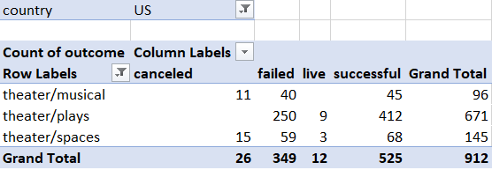
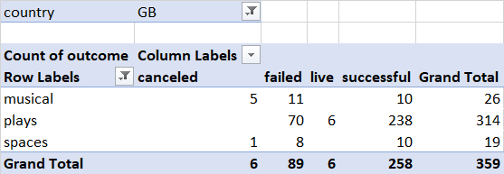

# "An Analysis of Kickstarter Campaigns by William Davis"
This is is an anlaysis that I have prepared for Louise to consider when planning her next kickstarter campaign.   
## General Remarks 
To begin the analysis of this kickstarter campaign our group started by collecting all of the sample of data caputred during previous campaigns. This analysis covers 4114 crowdfunding projects to uncover any hidden trends. The data was sorted and filtered in various categories including  goal and pledged amounts, percentgage funded , average donation, outcome, country, currency, deadline, dates, staff pick, category etc. This enabled us to ease to make quick observaitions regarding the collected data and identifiy apparent trends at a glance. Our analysis starts with some general trends and views of the crowdfunding projects analyzed
- The US had a significant amount of the crowdfunding projects analyzed with 3038 total projects. 
- The most crowdfunding projects were Theatres/Play which accounted for the most sucessful projects (694) as well as failed projects (353).
- Rock crowdfunding projects had 260 events that were all considered "sucessfull" with 0 failed or cancelled events.
- Conversely, Animation had 100 "failed" events and no events considered "sucessfull."
Included below is a chart which illustrates these findings.

## Theatre Events
To provide mroe relevant analysis to Louise's project,  these projects were filtered to analzye the theatre related events. Analysis focused on United States and Great Britain theatre events across each subcategory.   
### United States Theatre Campaigns
There were 912  campaigns reviewed for this analysis.  They are filtered between Musicals (96), Plays (671), and Spaces (145).  See the chart below. 

- Regarding musicals, 46% of the muscials had sucessful campains with 41% of the musicals failing and 11% cancellations. There were no live events.
- Regarding plays, 61% of the muscials had sucessful campains with 37% of the musicals failing and 1.3% of the events were live. There were no cancellations.
- Regarding spaces, 46.8% of the muscials had sucessful campains with 40.6% of the musicals failing and 10.3% cancellations. Approximately 2% of the events were live.
A deeper analysis was taken into kickstarter campains for musicals. 
The average goal amount of the campains was $50,960 with a median of $25,000.  This represents a skew resulting from large campaigns as half of all campaigns goals range from $5000 to $11,750. The average pledged amount $3005 with $8725. Have of all of the campains had pledged totals ranging between $1393 and $3990. 
### Great Britain Theatre Campaigns
A review for comparison was also taken of Great Britain's kickestarter theatre campains. There were 359  campaings reviewed for this analysis.  They are filtered between Musicals (26), Plays (314), and Spaces (19).  See the chart below.

-Regarding musicals, 38.4% of the muscials had sucessful campains with 42.3% of the musicals failing and 19% cancellations. There were no live events.
-Regarding plays, 75% of the muscials had sucessful campains with 22.2% of the musicals failing and 1.9% of the events were live. There were no cancellations.
-Regarding spaces, 52.6% of the muscials had sucessful campains with 42.1% of the musicals failing and 5% cancellations. There were no live events.
A deeper analysis was taken into kickstarter campains for musicals. 
The average goal amount of the campains was $4,059 with a median of $2,000.  This represents a skew resulting from large campaigns as half of all campaigns goals range from $537 to $5625. The average pledged amount $1046 with a median of $386. Have of all of the campains had pledged totals ranging between $28 and $1496. 
## Conclusions
Louise has a wealth of data to choose from when viewing the results of crowdfunding campaings for theatre events.  Sucessfull events typically have a goal around $5000-$12000 though there are larger campaings that were sucessful. Careful planning will be important if Louise is planning a campain larger than 12,000 and she may want analyze other factors which may contribute to the overall sucess of the campaign. 
### Challenge
An extended of analysis of kickstarter crowdfunding provides interesting new insights when considering the information from a different view. 
- Outcomes Based on Goals 
-- When reviewing the data after organizing the goal amount by the campaign outcome categories i.e. sucessfull, failed, canceled, and live; The failure rate generally increased with the increase in goal amount with the exception of goals ranging from $40009. 0-$44999. 
-- The most sucessful campaigns were goals within the lower and upper quartile range of $5000 to $11,750. These successful outcomes accounted for 85.5% of all sucessfull outcomes.
- Outcomes Based on Launched Date
-- When reviewing the data after organizing the  campaign outcome categories by month, the data reveals that summer months (May-Aug) have the highest activity with the largers margin of sucess to failure.  
-- December has the lowest margin of sucess to failure. 
-- January has the highest rate of cancellation throughout the year though it is fairly steady with the exception of July and October where there is 1 and 0 cancellations respectively. 
Some reasonable conclusions that can be drawn from this analysis is that planners should try to stay to a goal range of within the lower and upper quartile range of $5000 to $11,750 and plan to launch the events in the summer months.  Towards the end of the year in December and January are times to avoid if you want to maximize the potential for a sucessful event.  I recommend additional charts and figures which sort this data by country or by type of theatre event particularly musicals since that is Louises anticpated pursuit. 
